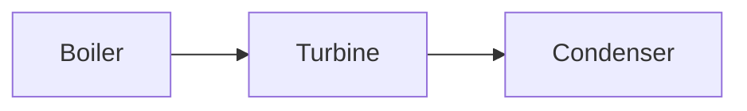

# Obsidian Markdown

Preserve the note's local style while producing valid Obsidian Flavored Markdown. Standard CommonMark and GFM are assumed; this skill focuses on Obsidian-specific behavior and failure modes.

Read supporting references only when needed:

- [references/PROPERTIES.md](references/PROPERTIES.md) for property types and YAML examples.
- [references/EMBEDS.md](references/EMBEDS.md) for note, image, audio, PDF, and query embeds.
- [references/CALLOUTS.md](references/CALLOUTS.md) for callout types and nesting.

For vault work, follow applicable `AGENTS.md` instructions and `vault-operator` when installed. Standalone fallback: edit only within the user’s requested scope, preserve unrelated content and conventions, then read back changes and inspect the diff.

## Helper paths and dependencies

Resolve the directory containing this loaded `SKILL.md` to an absolute path. In the commands below, set `skill_dir` to that directory; the example value is a placeholder. Keep the working directory unchanged so relative input and output paths retain their meaning in the user’s workspace. Quote all paths.

```bash
skill_dir="/absolute/path/to/obsidian-markdown"
```

The validator requires Python 3 and PyYAML. Check the selected interpreter with `python3 -c "import yaml"`. If unavailable, use an existing environment containing PyYAML or report the missing dependency; do not claim the validator ran. Install dependencies only within the user-authorized scope.

## Authorization and workflow

An active note, linked note, selection, or supplied source is context only. Modify or create a note only when the user explicitly requests that vault change.

For an authorized edit:

1. Read the target and inspect nearby notes only when needed to learn local conventions.
2. Preserve frontmatter and property types. Do not add `title`, tags, aliases, dates, or a template merely because they are available.
3. Preserve block IDs, links, embeds, equations, and unique nuance.
4. Resolve new internal links to real targets where practical.
5. Run the bundled Markdown validator using the invocation below.
6. Preview in Obsidian when the task depends on rendering, CSS, Mermaid, embeds, or plugin behavior.

## Internal links

Obsidian supports both wikilinks and Markdown links for vault files. Follow the vault setting and the target note's convention; do not rewrite existing links merely to enforce a preference.

```markdown
[[Note Name]]
[[Folder/Note Name|Display text]]
[[Note Name#Heading]]
[[Note Name#^block-id]]
[[#Heading in this note]]
```

Use vault-root-relative forward-slash paths when disambiguation matters. A block ID belongs after a paragraph or on its own line after a list/quote block:

```markdown
This paragraph can be targeted. ^stable-id

- First item
- Second item

^list-id
```

## Tables

Inside a Markdown table, escape any pipe used by a wikilink alias or embed size:

```markdown
| Concept | Figure |
| --- | --- |
| [[Entropy\|Entropy concept]] | ![[entropy-plot.svg\|420]] |
```

When editing a table, preserve alignment markers and keep the same number of unescaped cell separators in every row.

## Embeds

```markdown
![[Note Name]]
![[Note Name#Heading]]
![[image.svg|500]]
![[source.pdf#page=12]]
![[source.pdf#page=12&height=500]]
```

Follow the vault's attachment convention. Do not copy, move, download, or generate an attachment unless the user authorized that file change.

## Callouts

Use callouts semantically, not decoratively:

```markdown
> [!warning] Validity condition
> This relation assumes steady, one-dimensional flow.

> [!example]- Worked limiting case
> The expression reduces to ...
```

Prefer normal prose when a callout would not change how the reader interprets or retrieves the material.

## Properties

Properties are YAML frontmatter at the beginning of the file. Preserve existing property spelling and type across the vault.

```yaml
---
aliases:
  - Alternative title
tags:
  - thermodynamics/entropy
reviewed: 2026-08-30
related:
  - "[[Second Law of Thermodynamics]]"
---
```

Quote wikilinks in YAML. Add properties only when requested or required by an explicitly requested Base/workflow. If a property name already has a global type in Obsidian, do not write an incompatible value.

## Math and technical notes

Use dollar-delimited MathJax:

```markdown
Inline: $h = u + pv$

$$
\dot{S}_{gen} = \sum \frac{\dot{Q}_j}{T_j}
$$
```

Do not introduce `\[...\]`. Define symbols, keep notation consistent, and avoid Unicode lookalikes when LaTeX is clearer.

## Mermaid

````markdown

````

For clickable vault notes, Obsidian supports the `internal-link` class. Mermaid links do not create Graph-view backlinks, so add an ordinary wikilink nearby when discoverability matters.

## Validation

Run:

```bash
python3 "$skill_dir/scripts/validate_note.py" "path/to/note.md"
```

The validator checks frontmatter parsing, fence balance, dollar-display delimiters, bracket-style display math, wikilink balance, and Markdown table structure. Warnings require judgment; a clean static check does not replace an Obsidian preview.
