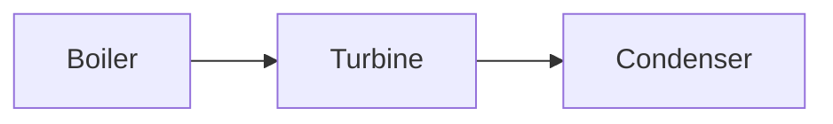

# Obsidian Markdown

Preserve the note's local style while producing valid Obsidian Flavored Markdown. Standard CommonMark and GFM are assumed; this skill focuses on Obsidian-specific behavior and failure modes.

Read supporting references only when needed:

- [references/PROPERTIES.md](references/PROPERTIES.md) for property types and YAML examples.
- [references/EMBEDS.md](references/EMBEDS.md) for note, image, audio, PDF, and query embeds.
- [references/CALLOUTS.md](references/CALLOUTS.md) for callout types and nesting.

For vault work, follow applicable `AGENTS.md` instructions and `vault-operator` when installed. Standalone fallback: edit only within the user’s requested scope, preserve unrelated content and conventions, then read back changes and inspect the diff.

## Helper paths and dependencies

Resolve the directory containing this loaded `SKILL.md` to an absolute path. In the commands below, set `skill_dir` to that directory; the example value is a placeholder. Keep the working directory unchanged so relative input and output paths retain their meaning in the user’s workspace. Quote all paths.

```bash
skill_dir="/absolute/path/to/obsidian-markdown"
```

Use the compiled Rust validator below; it accepts multiple files in one invocation. Ordinary frontmatter needs no Python. Uncommon YAML tags, aliases, complex keys, or parser disagreements use Python 3/PyYAML for compatibility. If that fallback is unavailable, the check reports an error; do not claim validation succeeded.

Build the release validator once per machine (and rebuild after source changes):

```bash
cargo build --release --locked --manifest-path "$skill_dir/scripts/vault-check/Cargo.toml"
```

The separate `vault` workflow CLI is sourced from `../vault-operator/scripts/vault-cli/` relative to this skill. Build and install it using `vault-operator` when needed. Install `vault` and `vault-check` into the same directory because `vault check` invokes its sibling validator. They do not need to remain linked to Cargo's generated `target/` directories.

Run the existing binary directly during routine edits; do not run Cargo or check Python dependencies each time. Source and locked dependencies live in `scripts/vault-check/`. If Rust cannot be built, the retained `scripts/validate_note.py` is a fallback requiring Python 3 and PyYAML. Report which fallback was used.

## Authorization and workflow

An active note, linked note, selection, or supplied source is context only. Modify or create a note only when the user explicitly requests that vault change.

For an authorized edit:

1. Read the target and inspect nearby notes only when needed to learn local conventions.
2. Preserve frontmatter and property types. Do not add `title`, tags, aliases, dates, or a template merely because they are available.
3. Preserve block IDs, links, embeds, equations, and unique nuance.
4. Resolve new internal links to real targets where practical.
5. Run the bundled Markdown validator using the invocation below.
6. Preview in Obsidian when the task depends on rendering, CSS, Mermaid, embeds, or plugin behavior.

## Internal links

Obsidian supports both wikilinks and Markdown links for vault files. Follow the vault setting and the target note's convention; do not rewrite existing links merely to enforce a preference.

```markdown
[[Note Name]]
[[Folder/Note Name|Display text]]
[[Note Name#Heading]]
[[Note Name#^block-id]]
[[#Heading in this note]]
```

Use vault-root-relative forward-slash paths when disambiguation matters. A block ID belongs after a paragraph or on its own line after a list/quote block:

```markdown
This paragraph can be targeted. ^stable-id

- First item
- Second item

^list-id
```

## Tables

Inside a Markdown table, escape any pipe used by a wikilink alias or embed size:

```markdown
| Concept | Figure |
| --- | --- |
| [[Entropy\|Entropy concept]] | ![[entropy-plot.svg\|420]] |
```

When editing a table, preserve alignment markers and keep the same number of unescaped cell separators in every row.

## Embeds

```markdown
![[Note Name]]
![[Note Name#Heading]]
![[image.svg|500]]
![[source.pdf#page=12]]
![[source.pdf#page=12&height=500]]
```

Follow the vault's attachment convention. Do not copy, move, download, or generate an attachment unless the user authorized that file change.

## Callouts

Use callouts semantically, not decoratively:

```markdown
> [!warning] Validity condition
> This relation assumes steady, one-dimensional flow.

> [!example]- Worked limiting case
> The expression reduces to ...
```

Prefer normal prose when a callout would not change how the reader interprets or retrieves the material.

## Properties

Properties are YAML frontmatter at the beginning of the file. Preserve existing property spelling and type across the vault.

```yaml
---
aliases:
  - Alternative title
tags:
  - thermodynamics/entropy
reviewed: 2026-08-30
related:
  - "[[Second Law of Thermodynamics]]"
---
```

Quote wikilinks in YAML. Add properties only when requested or required by an explicitly requested Base/workflow. If a property name already has a global type in Obsidian, do not write an incompatible value.

## Math and technical notes

Use dollar-delimited MathJax:

```markdown
Inline: $h = u + pv$

$$
\dot{S}_{gen} = \sum \frac{\dot{Q}_j}{T_j}
$$
```

Do not introduce `\[...\]`. Define symbols, keep notation consistent, and avoid Unicode lookalikes when LaTeX is clearer.

## Mermaid

````markdown

````

For clickable vault notes, Obsidian supports the `internal-link` class. Mermaid links do not create Graph-view backlinks, so add an ordinary wikilink nearby when discoverability matters.

## Validation

For files inside a vault, prefer the workflow CLI, which adds embedded-file checks to the existing syntax validator:

```bash
vault check --quiet -- "path/to/note.md"
```

Pass the exact edited files together. Use `vault check --changed --quiet` only for a session-wide check; it includes staged, unstaged and untracked notes in the vault's owning Git repository, excluding hidden paths and deletions, without inspecting nested repositories. Root selection and static embed-check limitations are documented in `vault-operator`. If `vault` is not on PATH, build it from `../vault-operator/scripts/vault-cli/` and place it beside `vault-check` before invoking `vault check`. Exit 1 includes missing/ambiguous embedded files; exit 2 is a usage/operational error. Heading and block fragments are not checked.

For standalone files, syntax-only checks, or when the workflow CLI is unavailable, run:

```bash
"$skill_dir/scripts/vault-check/target/release/vault-check" note --quiet "path/to/note.md"
```

`--quiet` suppresses OK lines, retaining warnings/errors; exit 0 means no errors, 1 means validation/read errors, and 2 means invalid arguments. Pass all changed notes together; use `--` before filenames beginning with `-`.

The validator checks frontmatter parsing, fence balance, dollar-display delimiters, bracket-style display math, wikilink balance, and Markdown table structure. Warnings require judgment; a clean static check does not replace an Obsidian preview.

### Preservation after incorporation or reorganization

Before editing, save the current note to a unique temporary file outside the vault (for example, `mktemp` followed by `cp`); use that snapshot, not Git HEAD, so existing user edits are included. After editing, use the Rust comparison instead of writing ad hoc Python preservation checks:

```bash
"$skill_dir/scripts/vault-check/target/release/vault-check" preserve --quiet "$before_note" "path/to/note.md"
```

Set `before_note` to the actual pre-edit snapshot. Exit 0 means no tracked findings; 1 means `REVIEW` findings to assess; 2 means a read, incomplete-structure, or usage error. `--quiet` suppresses only the clean summary. The command reads two files and never modifies them; it needs no Python.

It compares frontmatter text (ignoring CRLF/LF differences) and counts headings, wikilinks, wiki embeds, block IDs, and recognized exam/year mentions. Additions and reordering are allowed; removed occurrences and changed frontmatter are reported. Renames, alias/size changes, and deliberate duplicate consolidation can legitimately produce findings. Inspect them against the requested edit; do not automatically restore old content or request permission for routine authorized changes.

This is a lightweight structural scan: fences and inline-code link examples are excluded; ordinary Markdown/HTML links, prose, equations, and general citations are not inventoried. Exam detection recognizes GATE, ESE/IES, RRB/SSC (optionally JE), JKSSB, and ISRO followed by a nearby year, with limited qualifiers. It does not resolve targets, validate YAML, render notes, or prove technical completeness. Keep the normal syntax check, diff review, and source-to-note completeness review. If the snapshot is unavailable, report that limitation rather than treating a different baseline as the original.
